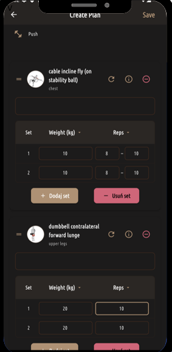
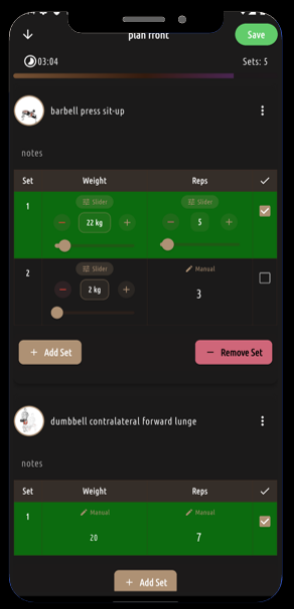

# Flex Plan — Exercise Plan Frontend

Krótki opis
-----------
Flex Plan to frontend aplikacji do tworzenia i śledzenia planów treningowych napisany we Flutter. Aplikacja pozwala tworzyć własne plany treningowe, zarządzać sesjami treningowymi, zapisywać wykonane treningi i przeglądać szczegóły ćwiczeń.

Screenshoty
----------
Tworzenie planu
---------------


Ćwiczenie z utwożony plane
--------------------------



Główne funkcje
--------------
- Tworzenie, edytowanie i usuwanie planów treningowych
- Dodawanie i konfigurowanie serii/powtórzeń dla ćwiczeń
- Rozpoczynanie i zapisywanie treningów (podsumowania, zdjęcie, opis)
- Lokalna pamięć (Hive) + synchronizacja z backendem
- Komponenty i pomocnicze narzędzia UI zoptymalizowane dla wygodnej pracy z planami

Szybkie uruchomienie
--------------------
Wymagania:
- Flutter (zalecana zgodna wersja z environment w pubspec.yaml)
- Dart SDK zgodny z projektem

Uruchom (przykład Web/Chrome z flagą CORS):
```
flutter run -d chrome --web-browser-flag "--disable-web-security"
```

Ważne pliki i punkty startowe
-----------------------------
- Główny punkt startu aplikacji: [lib/main.dart](lib/main.dart)  
  Wywołuje inicjalizator: [`AppInitializer.initialize`](lib/core/app_initializer.dart)
- Router i trasy aplikacji: [lib/core/app_router.dart](lib/core/app_router.dart)
- Ekran tworzenia planu: [lib/features/plan_creation/screens/plan_creation.dart](lib/features/plan_creation/screens/plan_creation.dart)  
  Przydatne helpery: [`PlanCreationHelpers.showUnsavedChangesDialog`](lib/features/plan_creation/components/plan_creation_helpers.dart)
- Ekran pracy z planem (workout): [lib/features/workout/screens/plan_works.dart](lib/features/workout/screens/plan_works.dart)
- Modele i Hive adapters: [lib/model/exercise.dart](lib/model/exercise.dart), inne w [lib/model/](lib/model/)
- Usługi komunikacji z backendem (przykład): [lib/services/exercisePlan.dart](lib/services/exercisePlan.dart)

Architektura / Struktura katalogów
----------------------------------
- lib/
  - core/ — inicjalizacja, router, deep links
  - features/ — logika UI podzielona na moduły (plan, plan_creation, workout, exercise, auth, itp.)
  - model/ — modele danych i adaptery Hive
  - services/ — warstwa komunikacji z API
  - provider/ — Riverpod providers / notifiers
  - shared/ — wspólne widgety i utilsy
  - theme/ — definicje stylów i stałych

Konfiguracja deweloperska
-------------------------
- Generowanie adapterów Hive (jeżeli zmieniasz modele):
```
flutter pub run build_runner build --delete-conflicting-outputs
```
- Zależności i upgrade:
```
flutter pub get
flutter pub upgrade
```

Uwagi implementacyjne
---------------------
- Inicjalizacja Hive i ustawienia aplikacji uruchamiane są w [`AppInitializer.initialize`](lib/core/app_initializer.dart).
- Przy zapisie planów wykorzystywana jest usługa w [lib/services/exercisePlan.dart](lib/services/exercisePlan.dart).
- Mechanizmy walidacji planów znajdują się w [lib/features/workout/components/plan_validation.dart](lib/features/workout/components/plan_validation.dart) i [lib/features/plan_creation/components/plan_creation_helpers.dart](lib/features/plan_creation/components/plan_creation_helpers.dart).

Przykładowe komendy developerskie
--------------------------------
- Uruchom aplikację web:  
  flutter run -d chrome --web-browser-flag "--disable-web-security"
- Zbuduj apk:  
  flutter build apk --release
- Generowanie modelów Hive:  
  flutter pub run build_runner build --delete-conflicting-outputs

Autor
---------------
Projekt: Praca inżynierska — frontend aplikacji Exercise Plan  
Masz pytania lub potrzebujesz wyjaśnień — dodaj issue lub PR.


Licencja
--------
(Tutaj dodaj rodzaj licencji, np. MIT)
